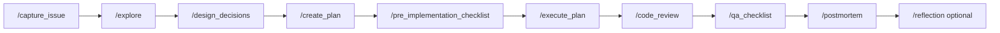

# Genesis Workflow Course

A practical guide to the **Creator → Genesis → Ship** loop in instantiated apps. Use with [.cursor/commands/workflow.md](../.cursor/commands/workflow.md) and Cursor slash commands.

---

## Who this is for

- Humans shipping features with AI agents in a Genesis-instantiated repo
- Contributors improving Genesis templates after postmortems

**Not covered here:** Organism runtime (`lib/`, `scripts/build.js`) — see [BLUEPRINT.md](BLUEPRINT.md).

---

## The loop (one feature)



**Entry:** `/genesis_run` (interactive or `--autonomous`) or individual commands.

**Strict order for `/genesis_run`:** capture → explore → **design_decisions** → **create_plan** → pre_implementation → execute → code_review → qa → postmortem. Optional after postmortem: `/reflection` (documentation handoff).

---

## Phase 1 — Planning (do not skip the plan file)

| Command | Output | Common mistake |
|---------|--------|----------------|
| `/capture_issue` | `.ai/context/last_capture.md` | Vague desired behavior |
| `/explore` | `.ai/context/last_explore.md` | Skipping constraints / non-goals |
| `/design_decisions` | `.ai/context/design_decisions.md` | Missing rendering strategy for formatted output |
| `/create_plan` | `.ai/context/last_plan.md` | **Reusing closed issue’s plan** |
| `/pre_implementation_checklist` | Gate before code | Proceeding with mismatched issue IDs |

**Rule:** Follow-on issues (v1.1, copy tweaks) still need a **new** plan file — not the previous closure’s plan.

---

## Phase 2 — Implementation

`/execute_plan` ends with two verification gates when applicable:

1. **Local dev verification** — tests, build, runbook, happy-path commands
2. **Deployment verification** — secrets, GHA dispatch, public URL, Pages CSS (see [GITHUB_PAGES_CHECKLIST.md](GITHUB_PAGES_CHECKLIST.md))

Stop and ask if you discover missing specs — do not silently expand scope.

---

## Phase 3 — Quality (standard, not optional for milestones)

| Command | Agent | Human |
|---------|-------|-------|
| `/code_review` | Security, architecture, correctness | — |
| `/qa_checklist` | `npm test`, build | Happy path, edge cases, UX |
| `/security_scan` | Optional | Auth, secrets, sensitive data |
| `/peer_review` | Optional | High-impact changes |

**Anti-pattern:** “Small copy change” → skip QA → ship → discover production-only behavior.

---

## Phase 4 — Ship & reflect

1. `git add -A && git commit && git push` (user terminal if agent lacks remote)
2. Verify automation artifacts on `main`
3. `/postmortem` → `.ai/context/postmortem_*.md` + `docs/CLOSURE_*.md`
4. Feed lessons to Genesis via PR or [INSTANTIATED_APP_FEEDBACK.md](INSTANTIATED_APP_FEEDBACK.md)

---

## Case study A — Greenfield scheduled product (AI Tastemakers DIG1)

**Profile:** New repo from `instantiate.sh`, daily GitHub Actions job, GitHub Pages.

| Lesson | What went wrong | Fix in workflow |
|--------|-----------------|-----------------|
| Production parity | “Done” = local CLI only | Deployment verification gate in `/execute_plan` |
| Pages CSS | `/assets/style.css` on project site | Relative paths checklist |
| GHA vs local git | Bot commit blocked push | `git pull --rebase` in common mistakes |
| External APIs | Stale model ID in `.env.example` | Verify provider IDs at implement time |

**Takeaway:** For cron/GHA products, MVP includes **one successful manual workflow dispatch** and **public URL check**.

---

## Case study B — Follow-on copy change (AI Tastemakers COPY)

**Profile:** Prompt + homepage copy only; no intended pipeline changes.

| Lesson | What went wrong | Fix in workflow |
|--------|-----------------|-----------------|
| Plan hygiene | `design_decisions` before `create_plan`; stale DIG1 plan | Enforce `last_plan.md` match early |
| Verification | Local same-day `npm run digest` to preview format | **Same-day re-run is not idempotent** |
| Scope blur | Soft-dedup reshuffled rankings; enrich drifted stars | Document provenance; prefer tests + GHA |
| Deploy chain | Digest bot commit did not update Pages | Verify or dispatch Pages after digest |

**Takeaway:** When output is **dated pipeline artifacts** (`briefings/YYYY-MM-DD/`), verification strategy must be explicit in explore/design:

| Change type | Preferred verification |
|-------------|------------------------|
| Prompt / format only | `npm run test:digest` + GHA dispatch |
| Homepage / static copy | `npm run build:pages` + Pages deploy |
| Ranking / discovery logic | Controlled local run or fixture date |

See [Scheduled pipeline idempotency](#scheduled-pipeline-idempotency) below.

---


## Case study C — Static layout refactor (AI Tastemakers LAND)

**Profile:** Flag-gated homepage reflow (`SITE_LANDING_LAYOUT_V2=1`); build-time HTML generator + Tailwind; experiment queued behind prior A/B test.

| Lesson | What went wrong | Fix in workflow |
|--------|-----------------|-----------------|
| Direction drift | Partial v2 code matched *old* experiment brief (sidebar synthesis), not revised capture (main-column reflow) | `/explore` **Conflicts with existing code** table before planning |
| Styling contract | Footer links visually collided despite Tailwind classes in TS strings | Component CSS in scanned `input.css` + explicit `&middot;` separators |
| QA blind spot | 150+ unit tests passed; spacing bug visible only in browser | `/qa_checklist` browser gate after `build:pages` |
| Experiment JSON | Hypothesis described superseded layout until mid-implementation | Update experiment metadata in same milestone as layout refactor |
| Ship | Local branch 11 commits behind GHA bot; rebase conflict | `git pull --rebase` before push (common mistake #17) |

**Takeaway:** For **generated static HTML**, treat spacing like email templates — never rely on utility-class strings alone in TS template literals. Verification = rebuild + browser at desktop and mobile widths.

**App-repo closure:** [EPH-20260701-LAND](https://github.com/Leftyshields/ai-tastemakers/blob/main/docs/CLOSURE_EPH-20260701-LAND.md)

---

## Scheduled pipeline idempotency

Applies to jobs that write **date-stamped folders** (digests, reports, snapshots).

**Same calendar day re-run risks:**

1. **Soft-dedup** — Prior run’s repos in `briefings/YYYY-MM-DD/` get penalized → ranking reshuffle
2. **Live API refresh** — Enrich step may overwrite snapshot star counts (±1 drift)
3. **Committed artifact churn** — Noisy git history, confused production state

**Safe patterns:**

- Unit/integration tests with mocked GitHub + Claude
- GHA `workflow_dispatch` as production truth
- If local re-run required: document `excludeDate` / provenance rules in app `ARCHITECTURE.md`

**Symptom → fix** rows belong in `docs/DEV_RUNBOOK.md` — see [DEV_RUNBOOK_TEMPLATE.md](DEV_RUNBOOK_TEMPLATE.md).

---

## Post-digest / post-bot deploy checklist

After a GitHub Actions bot commits artifacts:

1. `git pull` locally before further pushes
2. `gh run list --workflow="Deploy GitHub Pages"` (or your deploy workflow)
3. If missing: `gh workflow run "Deploy GitHub Pages"`
4. Hard-refresh public URL — new content + CSS

---

## Case study: Autonomous loop mode (`/genesis_run --autonomous`)

**When to use:** Repeatable features on a validated workflow — not first greenfield exploration.

**Setup:**

```bash
GENESIS_AUTONOMOUS=true npm run genesis:run -- init --autonomous
/genesis_run --autonomous
# include issue text in the same message for step 1 capture
```

**What differs from interactive:**

| Step | Autonomous behavior |
|------|---------------------|
| Design | Auto-generated with `Rationale:`; no confirmation gate |
| Code review | Auto-fix safe issues → `code_review_changelog.md` |
| QA | `genesis-run.js test`; one remediation retry; manual UX deferred |
| Postmortem | Run summary sections + closure doc |
| Reflection | Optional (`--reflect`) — update README/workflow for handoff |

**Orchestrator:** `scripts/genesis-run.js` owns `run_config.json`, test runs, and halt. Cursor commands remain the LLM steps.

**Anti-pattern:** Running autonomous on a novel product shape without prior interactive validation — design and plan quality suffer.

---

## Quick start path (small fixes)

For trivial bugs with clear scope:

1. `/capture_issue`
2. `/execute_plan` (mini plan in chat or `last_plan.md`)
3. `/code_review`
4. Deploy
5. `/postmortem` if process lesson learned

Still run tests. Still verify deploy if the fix touches customer-facing output.

---

## Contributing improvements

After `/postmortem` in any instantiated app:

1. Append to app `docs/INSTANTIATED_APP_FEEDBACK.md`
2. Open PR to [project-genesis](https://github.com/Leftyshields/project-genesis) updating templates/commands
3. Reference case study in this course if the lesson is reusable

---

**Last updated:** 2026-07-02 (EPH-20260701-LAND postmortem)
